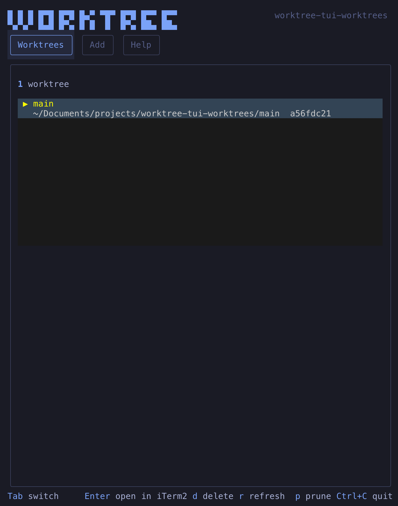
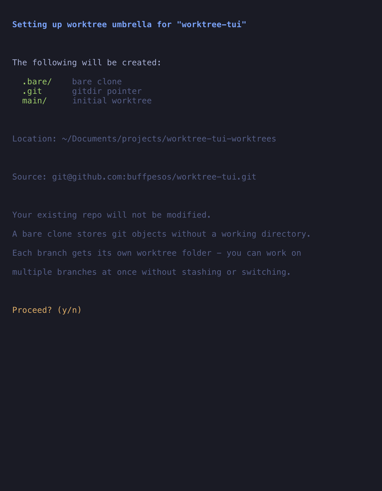
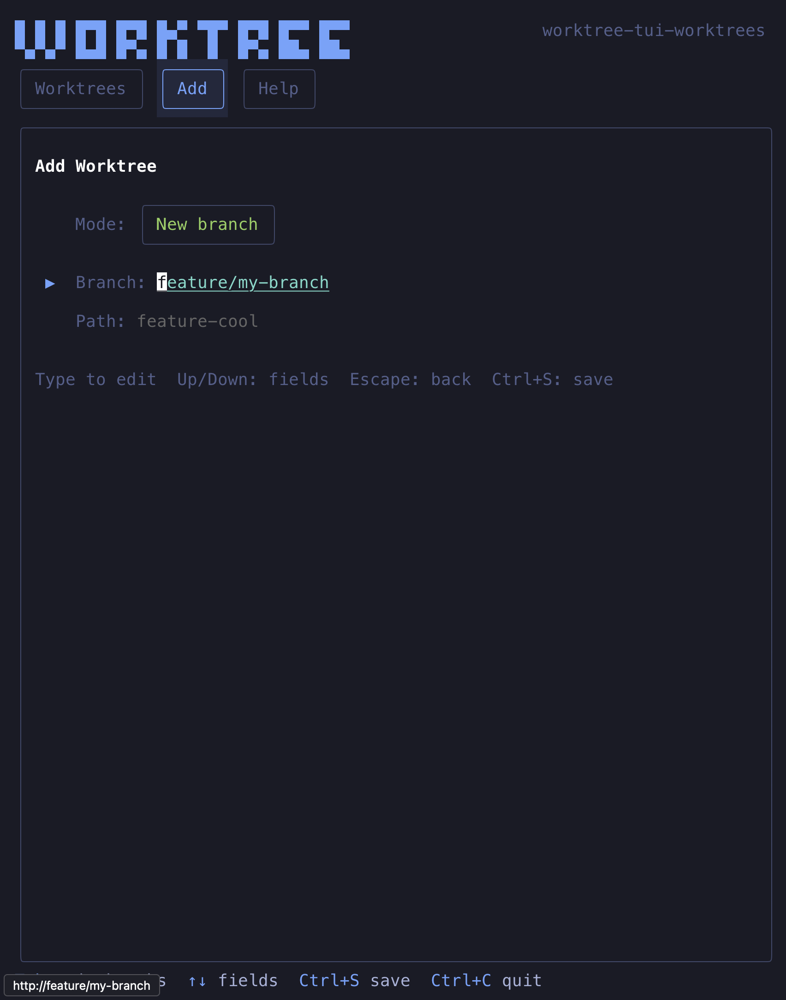

# worktree

A terminal UI for managing git worktrees — work on multiple branches simultaneously without stashing, switching, or losing context.



## The problem

Switching branches is disruptive. You stash half-finished work, lose terminal state, kill dev servers, and then forget what you stashed. If you need `.env` files, you're copying them around manually. Working on two features at once means constant context-switching overhead.

Git worktrees solve this by giving each branch its own directory — but setting them up correctly (bare clone, shared config, symlinked `.env` files) is tedious and error-prone.

## How worktree solves it

`worktree` sets up an **umbrella directory** with a bare clone at its core. Every branch gets its own folder, sharing git history, remotes, and config:

```
my-app-worktrees/
  .bare/            # bare clone (shared git objects)
  .git              # gitdir pointer → .bare
  .shared/          # untracked files shared across worktrees (.env, etc.)
  main/             # worktree for main branch
  feature-cool/     # worktree for feature/cool
  fix-bug/          # worktree for fix/bug
```

Each worktree is a fully independent working directory. `cd` into any of them and use git normally — commit, push, pull — without affecting others.

With a bare clone, there's no "primary" checkout — every branch is an equal worktree. This is cleaner than `git worktree add` from a regular clone and avoids accidentally working in the main checkout.



Run `worktree` in any existing repo and it creates the umbrella structure for you, with a confirmation screen explaining exactly what will happen first.



Create new worktrees from existing or new branches. Paths are auto-generated from branch names (`feature/cool` → `feature-cool`), and untracked files like `.env` are discovered and shared via symlinks.

## Features

- **Automatic setup** — Run `worktree` in any git repo or clone from a URL. Confirmation screen explains what will happen before anything is created.
- **Smart context detection** — Detects if you're inside an umbrella, a regular repo, or outside any repo, and adapts accordingly.
- **Shared files (`.shared/`)** — `.env` and other untracked files are copied to `.shared/` and symlinked into every worktree. Edit one, it updates everywhere.
- **Untracked file discovery** — When creating a worktree, existing worktrees are scanned for untracked and `.env` files. A tree-based file picker lets you select which to share. Build artifacts are auto-excluded.
- **Worktree management** — List, create, and remove worktrees. Branches already checked out are excluded from the picker.
- **iTerm2 + Claude integration** — Press Enter on a worktree to open it in a new iTerm2 window with `claude` running automatically.
- **CLAUDE.md shared across worktrees** — Place a `CLAUDE.md` at the umbrella root and it's available in every worktree. 2–3 concurrent Claude sessions is the sweet spot.
- **Educational UI** — Every confirmation screen explains the operation and how worktrees work. The Help tab includes a full cheatsheet.

## Install

```bash
bun install
bun link
```

This registers the `worktree` command globally.

## Usage

Run `worktree` from anywhere:

| Context | What happens |
|---|---|
| Inside an umbrella | Opens the TUI directly |
| Inside a regular git repo | Shows a confirmation screen, creates the umbrella, then opens the TUI |
| Not a git repo | Prompts for a remote URL to clone fresh |

Your original repo is **not** modified — the umbrella is created as a sibling directory. Once it exists, running `worktree` from anywhere inside it opens the TUI directly.

## Key bindings

| Key | Action |
|---|---|
| `Tab` / `Shift+Tab` | Switch tabs |
| `Enter` | Open worktree in iTerm2 (Worktrees tab) |
| `d` | Delete worktree (with confirmation) |
| `r` | Refresh worktree list |
| `p` | Prune stale worktree references |
| `Ctrl+S` | Create worktree (Add tab) |
| `Up`/`Down` | Navigate |
| `Escape` | Go back / cancel |
| `Ctrl+C` | Quit |

## The `.shared/` directory

Worktrees share git history but **not** untracked files. `worktree` solves this with `.shared/`:

1. During setup, pick which untracked files to share
2. Files are copied into `<umbrella>/.shared/`, preserving directory structure
3. Symlinks are created from each worktree back to `.shared/`
4. New worktrees get the same file picker to choose which `.shared/` files to link

The file picker shows untracked files and `.env*` files (even if gitignored), while excluding build artifacts (`.next/`, `node_modules/`, `dist/`, etc.) and `.DS_Store`. Directories can be toggled as a group.

## Under the hood

The umbrella setup runs:

```bash
# 1. Clone as bare repo
git clone --bare <remote> my-app-worktrees/.bare

# 2. Create gitdir pointer so git commands work from the umbrella root
echo "gitdir: ./.bare" > my-app-worktrees/.git

# 3. Fix fetch config (bare clones don't fetch all branches by default)
git -C my-app-worktrees/.bare config remote.origin.fetch "+refs/heads/*:refs/remotes/origin/*"
git -C my-app-worktrees/.bare fetch origin

# 4. Create the first worktree
git worktree add my-app-worktrees/main main
```

## Development

```bash
bun run dev    # watch mode
bun run start  # single run
```

Built with [Bun](https://bun.sh), [OpenTUI](https://github.com/anthropics/opentui), and [React](https://react.dev) (via OpenTUI's React reconciler).
